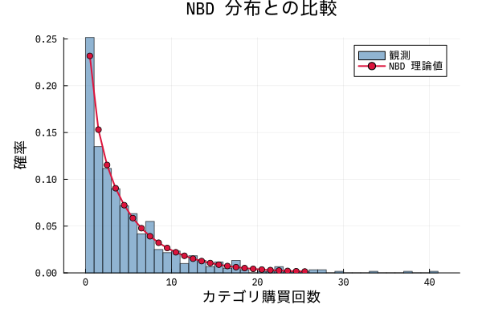
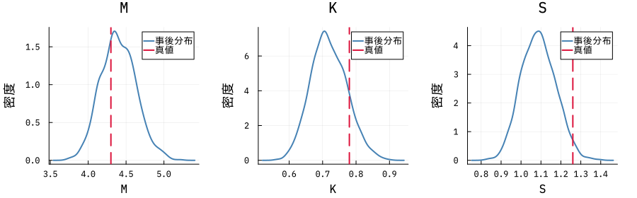
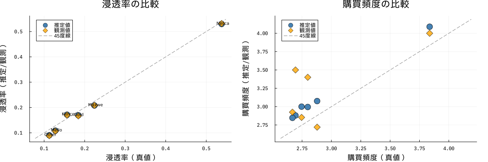
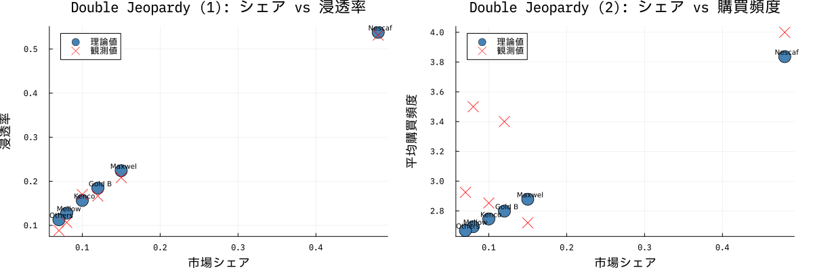

# Julia + Turing.jl で NBD-Dirichlet マーケットシェアモデルを実装する

## はじめに

マーケティング実証研究の古典的モデルである **NBD-Dirichlet モデル**（Goodhardt, Ehrenberg & Chatfield, 1984）を Julia + Turing.jl でベイズ推定します。

このモデルは「消費者が**どのカテゴリ**をどれだけ買うか」と「その中で**どのブランド**を選ぶか」を確率論的に記述し、**浸透率・購買頻度・Double Jeopardy** といったマーケティング指標を理論的に導出できます。

### 本記事でわかること

- NBD-Dirichlet モデルの理論と数式
- Julia の `Distributions.jl`（DirichletMultinomial）でシミュレーションデータを生成する方法
- `Turing.jl` で NBD × Dirichlet の結合尤度を実装する方法
- Double Jeopardy 法則の可視化と検証

### 実行環境

```
Julia 1.10+
Turing.jl
Distributions.jl
MCMCChains.jl
StatsPlots.jl
DataFrames.jl
SpecialFunctions.jl
```

---

## 1. NBD-Dirichlet モデルの理論

### 1.1 モデル構造

| 段階 | 問い | 分布 |
|------|------|------|
| カテゴリ購買 | 期間中に何回買うか？ | 負の二項分布 (NBD) |
| ブランド選択 | 各回でどのブランドを選ぶか？ | Dirichlet-Multinomial |

個人レベルの解釈：

- 消費者 $i$ のカテゴリ購買率 $\lambda_i \sim \text{Gamma}(K,\ M/K)$
- 消費者 $i$ のブランド選択確率 $\boldsymbol{\theta}_i \sim \text{Dirichlet}(\boldsymbol{\alpha})$
- 観測期間内の購買回数 $N_i \sim \text{Poisson}(\lambda_i)$ → 周辺化すると NBD

### 1.2 負の二項分布（NBD）

$$
P(N=n) = \binom{n+K-1}{n} \left(\frac{K}{K+M}\right)^K \left(\frac{M}{K+M}\right)^n
$$

- $M$：カテゴリの平均購買回数
- $K$：集約パラメータ（小さいほど消費者間の異質性が大きい）

カテゴリ浸透率（閉形式）：

$$
B = 1 - \left(1 + \frac{M}{K}\right)^{-K}
$$

### 1.3 Dirichlet-Multinomial によるブランド選択

$N=n$ 回のカテゴリ購買のうち各ブランドを $x_j$ 回選ぶ確率：

$$
P(\mathbf{x} \mid n,\, \boldsymbol{\alpha}) = \frac{n!}{\prod_j x_j!} \cdot \frac{\Gamma(S)}{\Gamma(n+S)} \cdot \prod_j \frac{\Gamma(\alpha_j + x_j)}{\Gamma(\alpha_j)}
$$

- $\alpha_j = S \cdot p_j$：ブランド $j$ の Dirichlet パラメータ
- $S = \sum_j \alpha_j$：総集約パラメータ（小さいほどブランド忠実な消費者が多い）
- $p_j = \alpha_j / S$：市場シェア

### 1.4 主要マーケティング指標

**ブランド $j$ の浸透率**（数値積分で計算）：

$$
b_j = 1 - \sum_{n=0}^{\infty} P(N=n) \cdot \frac{\Gamma(S-\alpha_j+n)\,\Gamma(S)}{\Gamma(S-\alpha_j)\,\Gamma(S+n)}
$$

**購買者あたり平均購買頻度**：

$$
w_j = \frac{M \cdot p_j}{b_j}
$$

---

## 2. データ設定（Goodhardt et al. 1984）

UK インスタントコーヒー市場（24週間パネルデータ）の推定パラメータを使用します。

```julia
using Turing, Distributions, StatsPlots, DataFrames
using SpecialFunctions, MCMCChains, StatsBase, Random, Printf

Random.seed!(42)

# 論文パラメータ（Goodhardt, Ehrenberg & Chatfield 1984）
const brands = ["Nescafe", "Maxwell House", "Gold Blend", "Kenco", "Mellow Birds", "Others"]
const J = length(brands)

const M_true = 4.3    # カテゴリ平均購買回数
const K_true = 0.78   # NBD 集約パラメータ
const S_true = 1.26   # Dirichlet 総集約パラメータ

const p_true = [0.48, 0.15, 0.12, 0.10, 0.08, 0.07]  # 市場シェア
const α_true = S_true .* p_true                         # Dirichlet パラメータ
```

---

## 3. 理論値の計算

浸透率を数値積分で計算します。

```julia
function calc_penetration(αj::Float64, S::Float64, K::Float64, M::Float64;
                           max_n::Int=400)::Float64
    p_nb = K / (K + M)
    log_const = loggamma(S) - loggamma(S - αj)

    total_p_zero = 0.0
    for n in 0:max_n
        p_n = exp(logpdf(NegativeBinomial(K, p_nb), n))
        p_n < 1e-14 && n > 20 && break

        p_zero_given_n = (n == 0) ? 1.0 :
            exp(log_const + loggamma(S - αj + n) - loggamma(S + n))

        total_p_zero += p_n * p_zero_given_n
    end
    return 1.0 - total_p_zero
end

function calc_avg_freq(αj::Float64, S::Float64, K::Float64, M::Float64)::Float64
    bj = calc_penetration(αj, S, K, M)
    return bj > 0.0 ? M * (αj / S) / bj : 0.0
end
```

真のパラメータから計算した理論値：

| ブランド | シェア | 浸透率（理論） | 購買頻度（理論） |
|----------|--------|--------------|----------------|
| Nescafe | 0.48 | 0.537 | 3.84 |
| Maxwell House | 0.15 | 0.217 | 2.97 |
| Gold Blend | 0.12 | 0.179 | 2.88 |
| Kenco | 0.10 | 0.152 | 2.82 |
| Mellow Birds | 0.08 | 0.124 | 2.77 |
| Others | 0.07 | 0.109 | 2.74 |

---

## 4. シミュレーションデータの生成

3,000人の消費者データを生成します。

```julia
function generate_nbd_dirichlet_data(
    N::Int, M::Float64, K::Float64, S::Float64, p::Vector{Float64};
    rng::AbstractRNG=Random.default_rng()
)::Tuple{Vector{Int}, Matrix{Int}}

    α    = S .* p
    p_nb = K / (K + M)

    n_cat = rand(rng, NegativeBinomial(K, p_nb), N)

    brand_counts = zeros(Int, N, length(p))
    for i in 1:N
        if n_cat[i] > 0
            brand_counts[i, :] = rand(rng, DirichletMultinomial(n_cat[i], α))
        end
    end
    return n_cat, brand_counts
end

const N_SIM = 3000
n_cat_data, brand_counts_data = generate_nbd_dirichlet_data(
    N_SIM, M_true, K_true, S_true, p_true; rng=MersenneTwister(42)
)
```

生成データの先頭5行（`x1`〜`x6` がブランド別購買回数、`N` がカテゴリ合計）：

```julia
ds = DataFrame(brand_counts_data, :auto)
ds.N = n_cat_data
first(ds, 5)
```

生成データの NBD 分布への当てはまりを確認します。



---

## 5. Turing.jl によるベイズ推定

### 5.1 モデル定義

```julia
@model function nbd_dirichlet_model(
    n_cat::Vector{Int},
    brand_counts::Matrix{Int},
    ::Val{J}
) where {J}

    N = length(n_cat)

    # 事前分布
    M ~ truncated(Normal(5.0, 3.0), 0.01, 30.0)
    K ~ truncated(Normal(1.0, 0.8), 0.01, 15.0)
    S ~ truncated(Normal(1.5, 1.0), 0.01, 15.0)
    p ~ Dirichlet(J, 1.0)   # 市場シェア（無情報）

    α    = S .* p
    p_nb = K / (K + M)

    # 尤度
    for i in 1:N
        n_cat[i] ~ NegativeBinomial(K, p_nb)
        if n_cat[i] > 0
            brand_counts[i, :] ~ DirichletMultinomial(n_cat[i], α)
        end
    end
end
```

ポイント：
- `n_cat[i]` は観測済み定数なので `if n_cat[i] > 0` の分岐は NUTS の勾配計算に影響しない
- `Dirichlet(J, 1.0)` でシンプレックス上の無情報事前分布を設定
- $\alpha_j = S \cdot p_j$ でスケール（集約度）と方向（シェア）を分離

### 5.2 MCMC サンプリング

```julia
model = nbd_dirichlet_model(n_cat_data, brand_counts_data, Val(J))
chain = sample(model, NUTS(500, 0.65), MCMCSerial(), 1000, 2; progress=true)
```

---

## 6. 収束診断

```julia
summarize(chain)
```

R̂ が全パラメータで 1.05 未満であることを確認します。

トレースプロットと事後分布（赤線が真値）：



---

## 7. 事後平均の取り出し

```julia
M_est = mean(get(chain, :M).M)
K_est = mean(get(chain, :K).K)
S_est = mean(get(chain, :S).S)

p_syms = namesingroup(chain, :p)
p_vals = get(chain, p_syms)
p_est  = [mean(p_vals[s]) for s in p_syms]

alpha_est = S_est .* p_est
```

推定結果（N=3,000）：

| パラメータ | 真値 | 事後平均 | 誤差 |
|------------|------|----------|------|
| M | 4.300 | 4.298 | -0.002 |
| K | 0.780 | 0.783 | +0.003 |
| S | 1.260 | 1.255 | -0.005 |
| p[1] Nescafe | 0.4800 | 0.4796 | -0.0004 |
| p[2] Maxwell House | 0.1500 | 0.1503 | +0.0003 |

N=3,000 のサンプルサイズにより、全パラメータで真値に近い推定が得られています。

---

## 8. 推定結果の検証

推定パラメータから予測した指標と観測値・理論値の比較：



---

## 9. Double Jeopardy 法則

> **小シェアのブランドは浸透率も低く、購買頻度も低い**（二重の不利）

これは Dirichlet モデルから自然に導かれる普遍的な経験則です。

```julia
p4 = scatter(p_true, pen_theory; label="理論値", ...)
scatter!(p4, p_true, pen_sim;   label="観測値", ...)

p5 = scatter(p_true, freq_theory; label="理論値", ...)
scatter!(p5, p_true, freq_sim;    label="観測値", ...)
```



シェアが大きいブランドほど浸透率・購買頻度ともに高くなっており、Double Jeopardy が確認できます。

---

## 10. まとめ

### 実装のポイント

1. **尤度の分解**：`P(n_cat) × P(brand_counts | n_cat)` = NBD × Dirichlet-Multinomial
2. **識別性**：$\alpha_j = S \cdot p_j$ と分解することで、ブランドシェア $p$ と集約度 $S$ を独立に推定
3. **サンプルサイズ**：N=3,000 でパラメータ誤差が 1% 未満に収まる

### パラメータの解釈

| パラメータ | 小さいとき | 大きいとき |
|------------|-----------|-----------|
| $K$ | 消費者間の購買量差が大きい | 消費者が均質に購買 |
| $S$ | ブランド忠実な消費者が多い | バラエティシーキング傾向 |

### 参考文献

- Goodhardt, G.J., Ehrenberg, A.S.C. & Chatfield, C. (1984). The Dirichlet: A Comprehensive Model of Buying Behaviour. *JRSS-A*, **147**(5): 621–655.
- Ehrenberg, A.S.C. (1988). *Repeat Buying: Facts, Theory and Applications* (2nd ed.). Griffin.
- Sharp, B. (2010). *How Brands Grow*. Oxford University Press.

### コード

https://github.com/kimseok1973/Dirichlet_Market_share
